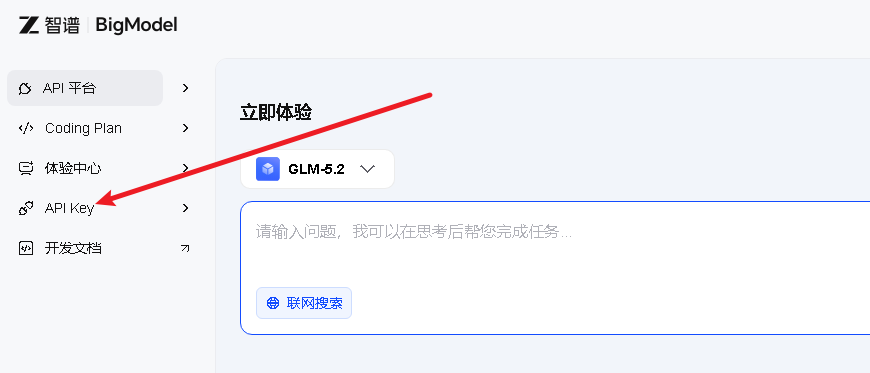
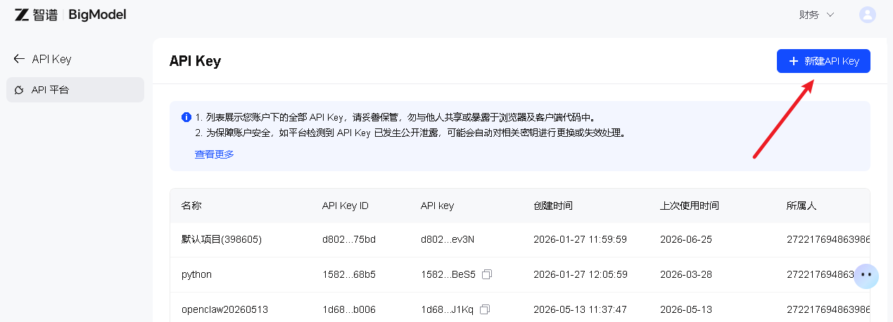
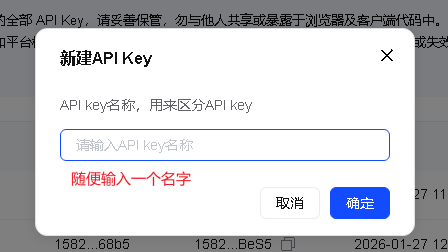
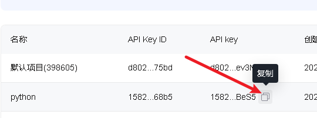
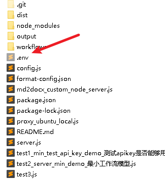
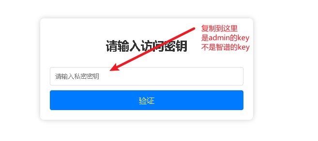
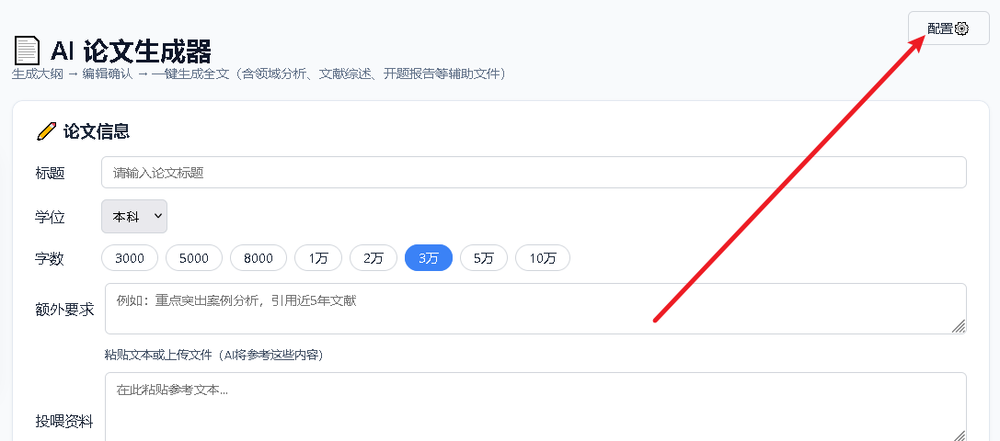
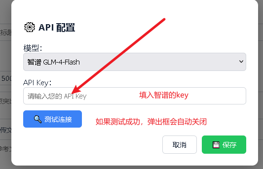

# 📄 论文 Agent 使用教程

> 从 **API Key 申请** 到 **生成全文**，手把手带你完成配置

---

## 1. 申请智谱 API Key

智谱开放平台提供免费的 API Key，用于调用大模型能力。**没有这个 Key，整个系统无法运作。**

### 1.1 登录 / 注册

访问 [智谱开放平台](https://open.bigmodel.cn/login?redirect=%2Fconsole%2Foverview)，使用手机号或邮箱完成登录 / 注册。

*登录后进入控制台概览页 · 图示为平台界面参考*

### 1.2 进入 API Key 管理

点击左侧菜单中的 **「API Key」**，进入 [API Key 管理页面](https://open.bigmodel.cn/apikey/platform)。

*左侧菜单 → API Key · 点击进入管理页*

### 1.3 创建新的 API Key

点击左上角的 **「新建 API Key」**，在弹出框中任意输入一个名称（如 `my-agent`），点击确认。

*输入名称后点击确认 · 名称仅用于标识*

### 1.4 复制 API Key

创建成功后，将鼠标悬停到新生成的 Key 上，点击右侧的 **复制图标**。请妥善保存，**后续配置需要用到**。

*悬停 → 点击复制按钮 · 复制后保存备用*

---

## 2. 从环境变量里面获取网页系统登录密钥

### 2.1 打开 `.env` 文件

在项目根目录找到 `.env` 文件（若没有则新建）。

*项目根目录下的 `.env` 文件 · 注意文件名以点开头*

### 2.2 复制 `ADMIN_SECRET_KEY`

在 `.env` 中找到 `ADMIN_SECRET_KEY=`，将 **等于号后面的内容复制**，准备在登录系统的时候输入。

---

## 3. 登录系统

在浏览器中访问本地服务地址，进入系统登录页。

访问 `http://localhost:3000`

打开浏览器，输入 `http://localhost:3000/` 进入系统主页。如果服务已启动，你会看到登录界面。

然后将前面复制的密钥粘贴进去，点击登录。

*系统登录页*

---

## 4. 配置系统

进入系统后，将智谱 API Key 填入配置项并测试连通性。

### 4.1 点击配置图标

进入系统主页后，点击右上角的 **⚙️ 配置图标**，打开配置弹窗。

*右上角配置图标 · 点击打开配置面板*

### 4.2 粘贴 Key 并测试

在弹出框中将智谱 API Key 粘贴到对应输入框，然后点击 **「测试」** 按钮。若提示成功，说明配置无误。

*粘贴 Key → 点击测试 · 测试通过后即可开始使用*

---

## 5. 开始使用

配置完成后，你就可以使用论文 Agent 辅助写作了。核心流程如下：

- 📝 输入论文标题
- 🤖 AI 生成大纲
- ✏️ 手动编辑大纲（可选）
- 📄 点击「生成全文」
- 📊 支持标注生成表格

> **💡 小贴士：**  
> 你可以让 AI 自动生成大纲，也可以手动将大纲复制到下方编辑区（需先点击「转换」），之后点击「生成全文」即可。系统已内置了 **标注生成表格** 的功能，在需要表格的地方用特定标记即可自动生成。

---

*智谱开放平台 · 论文 Agent 使用教程 | 如有问题请检查 API Key 是否有效*